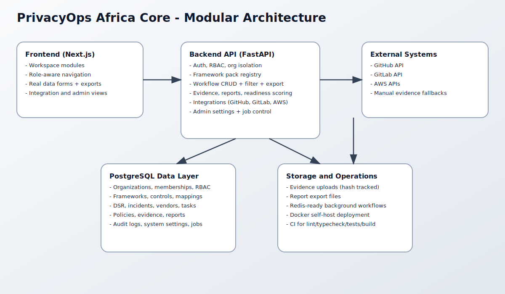
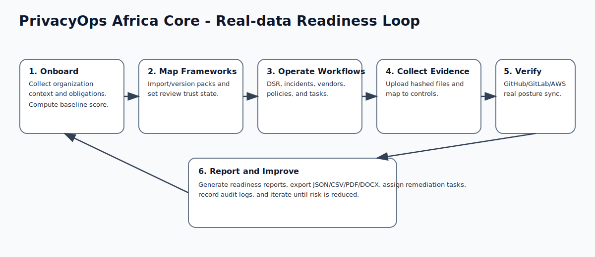

# Architecture Documentation

## Overview

PrivacyOps Africa Core is implemented as a modular web application with a clear split between frontend UX and backend domain APIs.

- `frontend/` handles user workflows, module navigation, empty-state UX, and action forms.
- `backend/app/routers` handles API surfaces by bounded module.
- `backend/app/services.py` handles core business logic and helper operations.
- `backend/app/models.py` defines relational persistence.

## Layered Backend Design

### Router Layer

- Validates request payloads via Pydantic schemas.
- Enforces authentication and authorization dependencies.
- Converts service output into API responses.

### Service Layer

- Trust Readiness Score computation.
- Readiness component breakdown.
- Audit event recording.
- Report export generation (`PDF`, `DOCX`, `CSV`, `JSON`).
- Integration fetch/scan helpers (GitHub, GitLab, AWS).

### Data Layer

- SQLAlchemy models for all tenancy, governance, and workflow entities.
- Organization ownership represented through `organization_id` on tenant data.
- Versioning entities for evidence and policies.

## Frontend Design

- Next.js app router with workspace route: `/app/[orgId]/[module]`.
- Shared shell component with module navigation.
- Module metadata registry (`frontend/lib/modules.ts`) to keep module UX wording structured.
- API abstraction in `frontend/lib/api.ts` with token propagation.

## Multi-Tenant Isolation in Runtime

- Membership checks run before all protected data access.
- Role checks restrict privileged actions (framework management, integrations, billing override).
- Audit events are recorded per tenant context.

## Security and Resilience Controls

- Password hashing with `pbkdf2_sha256`.
- JWT access-token authentication.
- RBAC enforcement at endpoint level.
- Rate-limiting middleware for abuse resistance.
- Security headers middleware (`CSP`, `HSTS`, `X-Frame-Options`, `nosniff`, `Referrer-Policy`).
- File upload size limits and SHA-256 hashing.

## Operational Components

- PostgreSQL as primary transactional store.
- Redis available for queue/cache expansion.
- Docker Compose orchestration for local and lower environments.
- CI pipeline for backend tests and frontend lint/typecheck/build gates.
